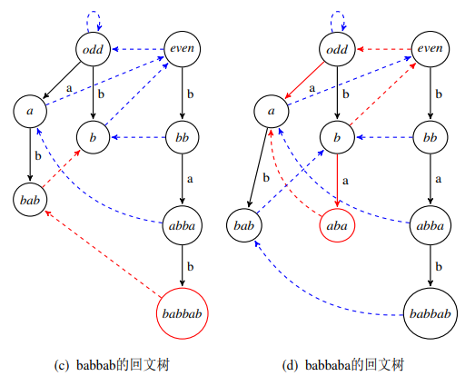
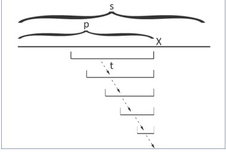

> 久违的学一点点东西得了。。。

## 简而言之

回文树是一种用来处理回文的自动机,可以处理一个字符串中的所有不同子串 

指路论文：https://victorwonder.blog.uoj.ac/blog/146

<!--more-->

# 首先

我们有这么一个结论：

> 一个长为n字符串中最多存在n个本质不同的回文子串

每次加入一个字符，假设生成了1个以上的本质不同回文子串

考虑生成的最长的和最短的回文子串A、B，那么有两种可能

- B的左端点在A的中点右边：由于B为回文串，则A中点左侧必定存在一个与B相同的回文串，矛盾
- B的左端点在A的中点左边：由于A为回文串，则B截去超出中点的镜像部分在A中点左侧必定存在相同的串，矛盾

因此每次加入一个字符生成本质不同回文子串最多一个

---

# 然后

我们就可以开始构造这个回文树了




如果这个图没有挂的话，

我们可以看出，这个玩意和sam啥的都很像，就是由转移边和fail指针（后缀link）组成的。

两个起始状态奇根和偶根就是用来存长度为奇数的回文串和长度为偶数的回文串

后缀link就是指向当前回文串的最长回文后缀。

---

# 具体

和那些奇奇怪怪的自动机一样，我们每次都加入一个字符。

假设已经处理了的串为s，我们要加入一个新的字符X，那么该怎么办呢？

首先我们找到串s的最长后缀回文串t（这玩意已经提前维护好了）

那么如果s的最后一段长成xtx这样，那么显然这玩意就是新串的最长回文后缀，然后我们还可以试图更新一下状态啥的
那**如果不是呢**

聪明的你一定想到了：肯定要用到后缀link呗， 不然哥们维护他干嘛

确实，只要找t的后缀link到的各个节点，一个个试即可，最后大不了到奇根。变成长度为1的回文子串即可。


### 一个小问题： 新出现的状态后缀link该往哪里连？

很显然，新状态的最长回文后缀也是Xt'X的形式，从新出现的状态接着往下找一找就完事了

这个理论上应该存在的图就很好的说明了整个流程



---

# 最后

> 喜闻乐见的代码时间！
>
> 板子，开超！

```c++
struct PAM{
    int nex[maxn][26];  //指向的一个字符的节点
    int fail[maxn]; //失配节点
    int len[maxn];  //当前节点回文长度
    int str[maxn];  //当前字符串
    int cnt[maxn];  //节点出现次数
    int last;   //目前走到哪个节点
    int tot;    //PAM中节点数
    int N;  //添加的串的个数
 
    int newnode(int L){ //新建节点
        for(int i = 0; i < 26; i++) nex[tot][i] = 0;
        len[tot] = L;
        cnt[tot] = 0;
        return tot++;
    }
 
    void init(){
        tot = 0;
        newnode(0);
        newnode(-1);
        last = 0;
        N = 0;
        str[0] = -1;
        fail[0] = 1;    //偶根指向奇根，因为到奇根必匹配
    }
 
    int getfail(int x){ //失配
        while(N - len[x] - 1 < 0 || str[N - len[x] - 1] != str[N]) x = fail[x];
        return x;
    }
 
    void add(char ss){
        int c = ss - 'a';
        str[++N] = c;
        int cur = getfail(last);    //最长可扩增的后缀回文节点
        if(!nex[cur][c]){
            int now = newnode(len[cur] + 2);
            fail[now] = nex[getfail(fail[cur])][c];
            //cur后缀(除自己)的最长的能让now失配的后缀
            nex[cur][c] = now;
        }
        last = nex[cur][c];
        cnt[last]++;
    }
 
    void count(){
        for(int i = tot - 1; i >= 0; i--)   //子节点出现父节点也出现
            cnt[fail[i]] += cnt[i];
    }
}pam;
```

