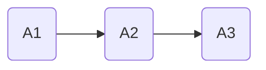
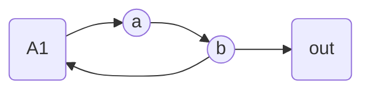
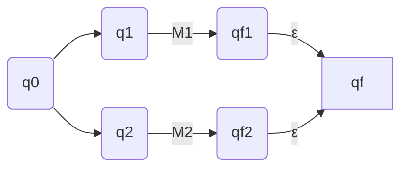
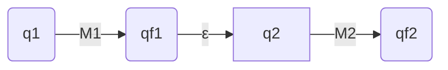

> 整蛊咯整蛊咯

# 基础知识

没啥p用

## 集合

**集合的基数**：有限集(不同元素个数)，无限集(等势，双射函数？)

可数集/不可数集：和自然数一一对应

## 逻辑

没什么好说的

## 图

图的定义：三元组$(V,E,\psi)$,点集、边集、边到两个端点集合的函数

子图、真子图、生成子图：生成子图有全部点集

略

## 证明技术

整蛊

<!-- more -->

----

# 语言及文法

终于开始学了

## 语言的定义与运算

字符集合：字母表，T（实际上是有限的）

定义：$\epsilon$空字符串

定义：$T^*$是所有字符串加空串的集合，$T^+$是所有字符串的集合

定义：语言L是$T^*$的子集，就是一些字符串的集合

定义：语言的乘积$L_1*L_2$是两者中的字符串连接构成的集合

定义：L的0次幂是空字符串

定义：$L^*$闭包，$L^+$正闭包，闭包0-n次幂的并，正闭包1-n次幂的并

## 文法

文法G：四元组G=(N,T,P,S)

- N 非终结符有限集
- T 终结符有限集
- P 生成式，“可被替代”的含义
- S 起始符

约定：

| 字母表中排在前面的小写字母a，b，c         | 终结符                                           |
| ----------------------------------------- | :----------------------------------------------- |
| **字母表中排在前面的大写字母A，B，C**     | **非终结符**                                     |
| **字母表中排在后面的大写字母X，Y，Z**     | **文法符号**（既可以是终结符，也可以是非终结符） |
| **字母表中排在后面的小写字母u，v，……，z** | **终结符号串**                                   |
| **小写的希腊字母α，β，γ**                 | **文法符号串**                                   |

推导与句型：latex箭头忘了是啥，反正就是通过生成式把字符串代换导出。句型是N和T的闭包内容，句子是T的闭包内容。

## 文法分类

### 定义

1型：上下文有关	$\alpha\rightarrow\beta,|\alpha|<=|\beta|$

2型：上下文无关	$A\rightarrow\alpha$

3型：正则	$A\rightarrow\omega B$，$A\rightarrow B\omega$右线性左线性

0型：0

### 2型文法各种表示法

BNF表示法：把左端相同的生成式合并，用|分隔，箭头用::=替代

语法图：

A->A1A2A3

A->abA

----

# 有限自动机和右线性文法

## 有限自动机

NFA，DFA：不确定和确定的有限状态自动机

疯狂地转移！

**形式定义**：DFA五元组，$M=(Q,T,\delta,q_0,F)$

- Q 有限状态集合
- T 有限输入字母表
- $\delta$ 转换函数 状态q，输入a到达状态p 写作$\delta(q,a)=p$
- $q_0$ 初始状态
- F 终止状态集

L(M)：为M接受的语言，其实就是有向图走来走去呗

## NFA

NFA是一堆节点在一个树上跑，看哪个能最终接受，类似dfs一样。

多种可能性。

## DFA和NFA

存在一个DFA和NFA等效。

子集构造法？

## 带空串转换的NFA

存在无空串转换的NFA和有空串的NFA等效

看不懂证明

## 正则

定义：递归定义如下

- 空字符串和空集都是正则式
- 字母表中的字母是正则式
- 如果A，B都是正则式，那(A+B)，(A·B)，(A*)都是正则式

可以给定右线性文法算出正则式

规则R：设x=ax+b，其解x=a*b

解方程(

## 右线性文法和正则集

一个语言是正则集，当且仅当该语言为右线性语言

## 正则表达式和有限自动机

定理：L是正则表达式R表示的语言，则存在一个具有$\epsilon$转换的有限自动机接受语言L

扩充正则式：

- R是正则式，则$R,R^*$为扩充正则式

- $R^{+k},R^{*k}$->R到R的k次幂的并，以及空集
- 若$R_1,R_2$为扩充正则式，则$R_1R_2,R_1+R_2$也是

可以通过正则式构建带空串转换的NFA

设R1，R2的两个NFA为M1，M2

R1+R2：并联

R1+R2：串联

定理：L被DFA接受，L可以用正则表达式表示
